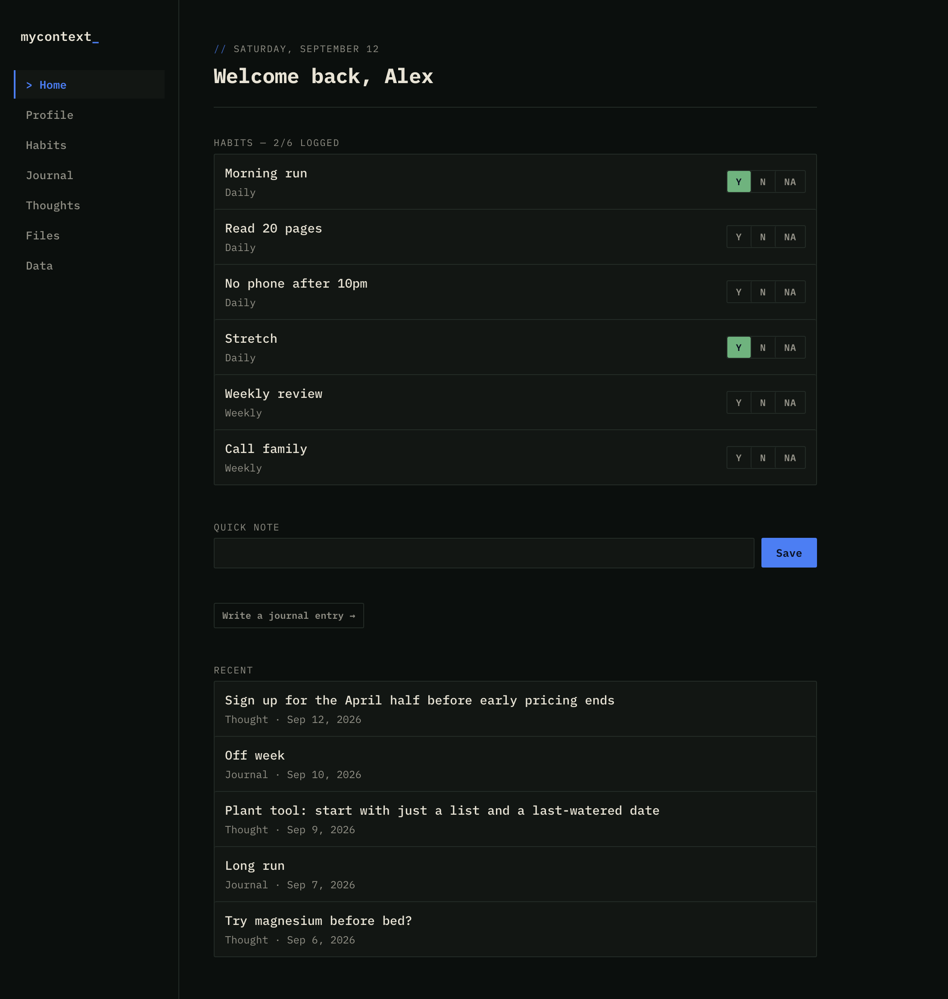
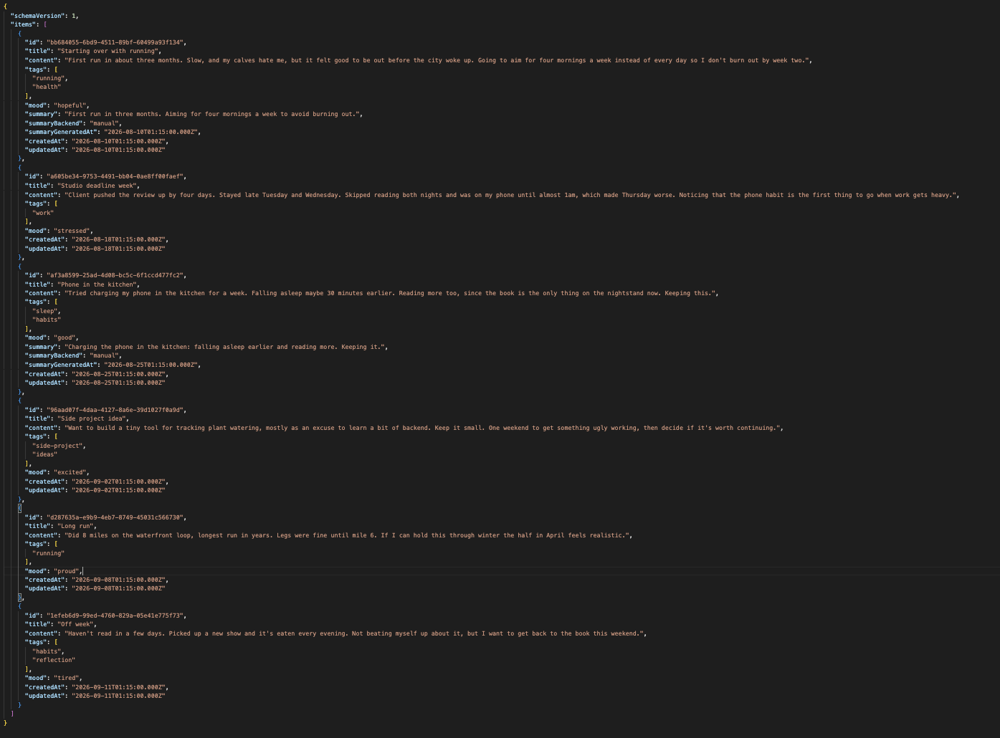
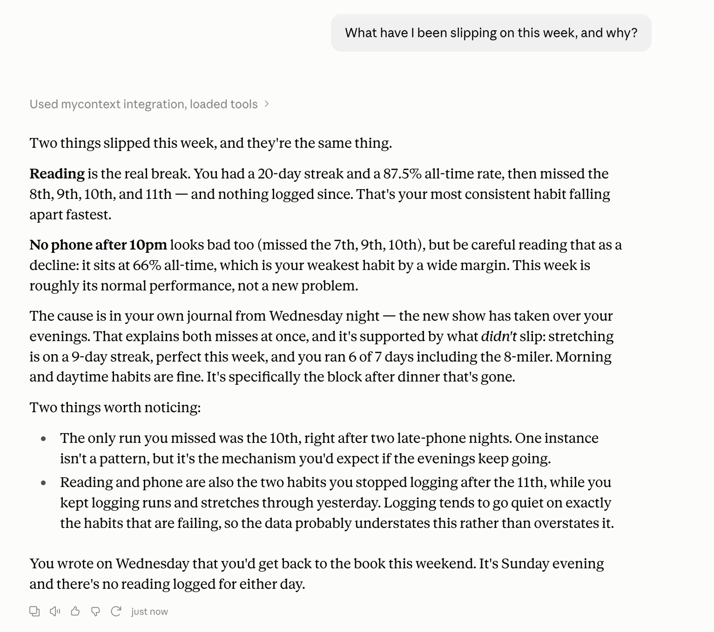

# mycontext

**Own the context your AI assistant reads.**

[](https://github.com/bencoleman24/mycontext/actions/workflows/ci.yml)
[](LICENSE)

A local environment to collect, manage, and own your personal data.

Includes:

- a local workflow for personal data management
- an MCP server, so AI apps like ChatGPT, Claude, Cursor, and Gemini can read and write the data directly
- plain JSON files you can read without this app, and export as Markdown, JSON, or CSV for personal use

<table>
  <tr>
    <td align="center" width="33%"><a href="docs/images/home.png"></a><br><sub>Log your personal data in the web UI</sub></td>
    <td align="center" width="33%"><a href="docs/images/journal_json_example.png"></a><br><sub>Stored as plain JSON files</sub></td>
    <td align="center" width="33%"><a href="docs/images/hero.png"></a><br><sub>Ask AI about your data</sub></td>
  </tr>
</table>

## Why mycontext

Most AI assistants today keep their memory of you on their own servers. That makes it harder to switch providers, and gives them a lot of control over your data. I think this issue will be exacerbated as AI becomes more integrated with our day to day life. I think it's worth keeping/maintaining a personal collection of data that you fully own.

mycontext keeps that data in plain files on your machine and this project contains tools to help you manage and utilize this data.

## Works with

AI apps that can run MCP servers on your computer, including the ChatGPT desktop app, Claude Code, Claude Desktop, Codex CLI, Cursor, Gemini CLI, and VS Code with GitHub Copilot. See [Connect an app](docs/mcp.md#connect-an-app).

Web and mobile chat apps can't reach a server on your computer. For those, export your data from the web UI and paste it into the chat.

## Quickstart

```bash
git clone https://github.com/bencoleman24/mycontext.git
cd mycontext
npm install
npm run setup
```

`npm run setup` builds the project, then prints instructions for connecting mycontext to the AI apps it finds on your computer. It doesn't change any app's settings. Instructions for every supported app are in [Connect an app](docs/mcp.md#connect-an-app).

Then start the web UI:

```bash
npm run web
```

It opens at `http://127.0.0.1:4823`.

## Documentation

| | |
|---|---|
| [Web UI](docs/web-ui.md) | The web app |
| [MCP tools and resources](docs/mcp.md) | What AI apps can read and write, and how to connect them |
| [Data model](docs/data-model.md) | Files on disk, habit rules, schema versions, configuration |
| [Journal summaries](docs/journal-summaries.md) | Summarizing entries to keep exports small |
| [HTTP API](docs/http-api.md) | Routes for scripting |
| [Architecture](docs/architecture.md) | How the code is organized |

## Privacy

Your data stays on your machine. No telemetry, no cloud sync, no external network calls. The web UI binds to local host only.

Two files in the codebase can make network calls:

- [`src/lib/summarizer.ts`](src/lib/summarizer.ts) — calls Ollama on `localhost`, ONLY when you ask for a summary
- [`src/web/public/app.js`](src/web/public/app.js) — the web UI calling its own backend on `127.0.0.1`


## License

MIT
